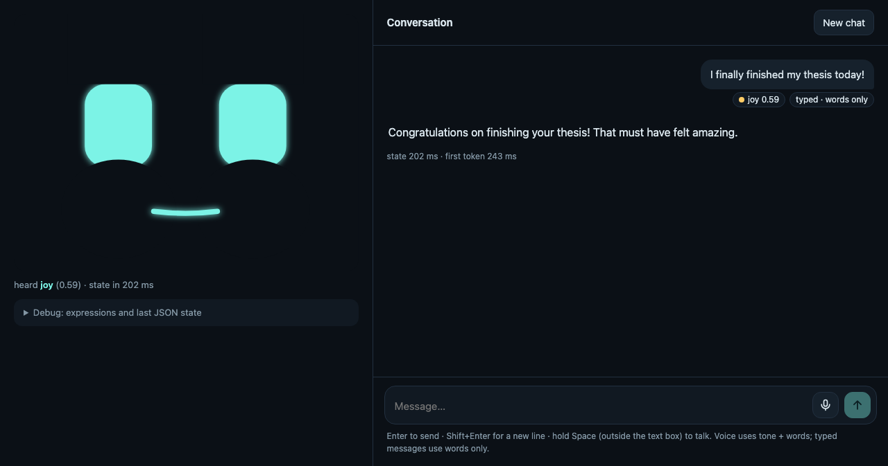

# Emotion-aware replies from text + audio (MELD)

## Summary

This prototype takes one conversational utterance (a 16 kHz clip plus its transcript,
or a Whisper transcript), predicts one of MELD's 7 emotions, emits a JSON state, then
streams a short emotion-aware reply from a local LLM. Two frozen encoders (RoBERTa
for text, WavLM for audio) feed a small trained fusion head. On the official MELD
test split, my dev-selected fused model reaches **0.614 ± 0.006 weighted F1**,
against 0.613 ± 0.005 for the best text-only model (with dialogue context) and
0.469 ± 0.002 for audio alone. Without dialogue context, adding audio lifts text from
0.609 to 0.621. On an Apple M5 the JSON state arrives in a median **46 ms** after
the end of the utterance when a transcript is supplied (152 ms including Whisper), the
first reply token a median 205 ms after that, and the robot's spoken reply is ready to
play a median **752 ms** after the person stops talking (Whisper included). The whole
inference path, speech output included, is 2.09B parameters (limit 6B), runs fully
offline, and peaks at about 5.5 GB. Beyond the
core: a per-utterance error breakdown, a test of "train harder on the failures"
(it hurts), a Whisper-transcript evaluation, and a reply-compliance comparison across
three LLM sizes that picks the reply model by a rule fixed before running. A local
chat page (`face_server.py`) puts it all behind an animated face: type or talk, and
the face reacts to the emotion state before the reply is spoken (Kokoro-82M, with a mute
button). An end-to-end system check (`scripts/13_system_check.py`) passes every check
(`results/system_check.md`).

## Quickstart

Tested on macOS (Apple Silicon, MPS) with Python 3.11. The code also selects CUDA or
CPU automatically (`config.py`), but I only ran it on the hardware below.

```bash
# 1. Environment (uv or plain pip both work)
uv venv --python 3.11 .venv && source .venv/bin/activate
uv pip install -r requirements.txt          # needs ffmpeg on PATH too (brew install ffmpeg)

# 2. Hardware report + download all model weights (up to ~10 GB on disk, the only online step)
python scripts/00_check_env.py

# 3. Data: MELD audio, official splits (1.5 GB). See "Data source" below.
python -c "from huggingface_hub import snapshot_download; snapshot_download('ajyy/MELD_audio', repo_type='dataset', local_dir='data/raw/meld_audio_hf')"
cd data/raw/meld_audio_hf && for s in train dev test; do tar -xzf archive/$s.tar.gz; done && cd -

# 4. The pipeline, in order
python scripts/01_prepare_meld.py       # ~1 min:  clips -> 16 kHz wav, manifests with context
python scripts/02_extract_features.py   # ~11 min: cache RoBERTa + WavLM embeddings
python scripts/03_train_eval.py         # ~1 min:  all heads x 3 seeds, metrics, plots, examples
python scripts/04_count_params.py       # <1 min:  results/params.json
python scripts/05_bench_latency.py      # ~2 min:  results/latency.json

# 5. Optional analyses (all write to results/)
python scripts/06_response_samples.py   # ~10 min: reply compliance across LLMs + with/without pairs
python scripts/07_asr_eval.py           # ~7 min:  test score with Whisper transcripts
python scripts/08_blind_review.py       # interactive, ~10 min: blind with/without-emotion preference
python scripts/09_error_analysis.py     # <1 min:  per-utterance predictions, error breakdown
python scripts/10_improvement_experiments.py  # ~5 min: hard-example upweighting, focal loss, neutral offset
python scripts/11_asr_matched_training.py     # ~25 min: heads trained on Whisper transcripts
python scripts/12_idle_latency.py       # ~5 min:  latency after idle gaps, with and without a warm-up ping
python scripts/13_system_check.py --server http://localhost:8000   # ~5 min: requirements + model checks

# 6. Demo: the chat face (open http://localhost:8000), or the command line
python face_server.py
python demo.py --meld test dia113_utt10                 # MELD clip, gold transcript
python demo.py --meld test dia113_utt10 --asr           # same clip, Whisper transcript
python demo.py --wav my_clip.wav                        # any clip, Whisper transcript
python demo.py --wav my_clip.wav --text "I'm fine"      # any clip, your transcript
```

Run times are approximate, observed on the hardware below. 06 needs the extra
models `Qwen/Qwen2.5-3B-Instruct` and `Qwen/Qwen3-4B-Instruct-2507` in the local
cache for its comparison (download them once with `huggingface_hub.snapshot_download`). The official
MELD.Raw archive (mp4s) also works: put it under `data/raw/` and `01_prepare_meld.py`
finds it (it accepts mp4 or flac clips).

## Demo

`python demo.py --meld test dia113_utt10` (from `results/demo_trace.txt`). The
text-only head reads the words as joy; with audio the fused model predicts anger, the
gold label. The reply LLM never sees the word "anger": it gets tone guidance ("stay
calm and steady, acknowledge the problem plainly, and offer to help").

```
== loading models on mps ==
cold load: 4.8 s  {"text_encoder": 0.56, "audio_encoder": 0.46, "text_head": 0.09, "fused_head": 0.02, "llm": 3.67}
warm-up pass (not timed below): 0.8 s

== input ==
audio: data/wav/test/dia113_utt10.wav
context:
  Chandler: I'm not a dropper!
  Ross: It's really a uh-uh three person game, y'know?
gold label (MELD annotation, for reference only): anger

== JSON state (emitted before the reply) ==
{
  "utterance_id": "dia113_utt10",
  "transcript": "It's throwing and catching!",
  "transcript_source": "gold",
  "emotion": "anger",
  "probs": {
    "anger": 0.7264,
    "disgust": 0.0047,
    "fear": 0.0012,
    "joy": 0.1951,
    "neutral": 0.0393,
    "sadness": 0.0026,
    "surprise": 0.0307
  },
  "confidence": 0.7264,
  "text_only_emotion": "joy",
  "audio_changed_prediction": true,
  "latency_ms": {
    "audio_load": 4.8,
    "asr": 0.0,
    "text_enc": 14.0,
    "audio_enc": 48.3,
    "heads": 0.8,
    "state_total": 67.8
  }
}

== reply (streamed) ==
Gotcha, sounds like we need some practice. Let's work on it together.

== latency (ms) ==
{
  "audio_load": 4.8,
  "asr": 0.0,
  "text_enc": 14.0,
  "audio_enc": 48.3,
  "heads": 0.8,
  "state_total": 67.8,
  "llm_first_token": 375.8,
  "llm_total": 911.5
}
```

The JSON state also comes back from `Pipeline.analyze()` (`src/pipeline.py`), so a
robot controller can change its face before the reply starts.

## Interactive face (chat)

`python face_server.py`, then open http://localhost:8000. You can **type** or **talk**
(click the mic, or hold Space outside the text box), or play one of five MELD clips from
`results/examples.md`. Each message shows its emotion state as chips; the reply is
spoken aloud and appears in the conversation as it is said. The speaker button in the
header mutes the voice (remembered between visits).



- **Voice** goes through Whisper and the fused model (tone + words). **Typed** messages
  use the text-only head (words only, its own dev-fit temperature T = 1.01) and are
  labeled that way in the chat. Both share one conversation history, whose last two
  lines are the context for the next turn.
- **The face** is a handful of numbers drawn in SVG (`face/face.js`): `eye_open`,
  `lid_tilt` (angry inner slant vs sad droop), `mouth_curve`, `mouth_open`, plus eye
  size, a "happy" lower lid, eye asymmetry and a round or shifted mouth for the
  expressions that need them. At rest the face wears a slight smile. The detected
  emotion is blended toward that resting face by 1 − confidence, so an unsure
  classifier gives a reserved face. Changes ease in over
  about 200 ms, with idle blinks every 3 to 6 s and small gaze shifts.
- **One turn**: listening (eyes widen and pulse with the voice or keystrokes) →
  thinking (glance up-right) → the detected emotion, held 0.9 s → the robot's own
  *empathic* face while it replies (calm and steady for anger, gentle for sadness;
  it matches the tone guidance the LLM gets) → back to the resting smile.
- **Speech.** Each reply sentence is synthesized by Kokoro-82M as soon as the LLM has
  written it, on the CPU, while the LLM writes the next sentence on the GPU. The page
  plays it and the mouth opens with the loudness of the audio being played (the
  Stack-chan approach), with the words appearing across the sentence. **Muted**, the
  server skips synthesis entirely and the mouth is text-paced instead (one pulse per
  syllable-sized chunk of each word).
- **Nothing heard.** If the audio is near-silent (raw RMS below 5e-4; the system check
  confirms no real MELD dev or test clip is that quiet) Whisper is skipped; if the transcript is empty,
  the state says `heard: false`, the face stays neutral, and the reply is a fixed
  "Sorry, I didn't catch that." Without this, an empty transcript produced a confident,
  arbitrary emotion (anger 0.92 in the system check).
- **Keeping the GPU warm.** On Apple Silicon the first turn after a few idle seconds is
  slower (see the idle table under "Real-time definition"), so the page pings the
  server every second while you talk or type.

All seven expressions at confidence 0.9, a low-confidence anger (0.45), the reply faces
and the talking mouth: [results/face_expressions.png](results/face_expressions.png).

## Architecture

```
                 utterance (16 kHz audio)  [+ transcript, + previous 2 lines]
                         |
          +--------------+------------------------------+
          |                                             |
   no transcript? -> Whisper-small (ASR)          EMODE normalization
          |                                             |
   RoBERTa-base (frozen)                         WavLM-base-plus (frozen)
   context </s></s> utterance,                   13 hidden layers, each
   mean-pool utterance tokens -> 768             mean-pooled over time -> 13x768
          |                                             |
          |                                   learned softmax layer weights -> 768
          +-------------------+-------------------------+
                              |
              concat 1536 -> LayerNorm -> Linear 256 -> GELU -> Dropout -> Linear 7
                              |                     (+ text-only head on the left branch,
                      softmax(logits / T)              to flag when audio changed the answer)
                              |
                   JSON state (emitted first)
                              |
            emotion -> tone guidance (the label word never reaches the LLM)
                              |
            Qwen2.5-1.5B-Instruct: 3 example exchanges + transcript, context,
            tone guidance; stops after 2 sentences; emotion words blocked
                              -> streamed reply
                              |
            Kokoro-82M (CPU), one sentence at a time -> speech (chat page, unless muted)
```

Parameter counts, from `results/params.json` (`sum(p.numel())` on the loaded models):

| Component | Model | Parameters | Runs |
| --- | --- | ---: | --- |
| Text encoder | `roberta-base` (no pooler) | 124,055,040 | always |
| Audio encoder | `microsoft/wavlm-base-plus` | 94,381,936 | always |
| Text-only head | own MLP (`checkpoints/text_head.pt`) | 200,199 | always |
| Fused head | own MLP + layer weights (`checkpoints/fused_head.pt`) | 398,356 | always |
| ASR | `openai/whisper-small` | 241,734,912 | when no transcript is given |
| Reply LLM | `Qwen/Qwen2.5-1.5B-Instruct` | 1,543,714,304 | always |
| Speech (TTS) | `hexgrad/Kokoro-82M` | 81,810,022 | chat page, unless muted |
| **Total** | | **2,086,294,769** | 35% of the 6B limit |

The code is laid out by stage: `src/audio.py` (loading + EMODE normalization),
`src/encoders.py` (RoBERTa, WavLM, Whisper wrappers), `src/fusion.py` (heads),
`src/responder.py` (prompt, decoding constraints, streaming), `src/tts.py` (Kokoro),
`src/reply_checks.py`
(sentence and emotion-word checks), `src/pipeline.py` (end to end), and
`config.py` (every path, model name and hyperparameter).

## Real-time definition

Interaction is **turn-level**: the robot reacts after the speaker finishes an
utterance, as people do (gaps between conversational turns are typically a few hundred
milliseconds). Latency is measured from the moment the finished utterance is handed
to the pipeline. Targets: the JSON state within 300 ms on a GPU (1 s on CPU), and the
first reply token within 1 s on a GPU (3 s on CPU). Because the state comes first, a
robot can change its face or posture right away, then speak.

Measured over 50 MELD test clips (median 2.4 s long, longest 7.6 s), after 3 warm-up
clips, from `results/latency.json`:

| Stage | p50 (ms) | p95 (ms) |
| --- | ---: | ---: |
| Audio load + normalize | 3.2 | 4.6 |
| ASR (Whisper-small) | 104.7 | 156.7 |
| Text encoder | 8.3 | 10.5 |
| Audio encoder | 34.0 | 61.1 |
| Heads | 0.6 | 0.8 |
| **State, transcript supplied** | **45.8** | **77.0** |
| **State, including ASR** | **151.8** | **235.8** |
| LLM first token (after state) | 205.4 | 267.2 |
| First spoken sentence ready (after state) | 586.3 | 964.5 |
| **End of speech → robot's audio ready, transcript supplied** | **642.1** | **1009.2** |
| **End of speech → robot's audio ready, including ASR** | **752.4** | **1108.7** |

- The state meets the 300 ms target at p50 and p95, with or without Whisper.
- First reply token: well inside 1 s. The first spoken sentence takes longer, because
  the LLM must finish the sentence (and Kokoro synthesize it, a median 404 ms per reply
  on the CPU) before playback can start. The face reacts to the state long before that.
- In the same-run comparison of prompts (`results/reply_compliance.md`), the final
  prompt's first token is slower than the first prompt's (308 vs 182 ms median),
  because it carries three example exchanges the model must read first.
- MPS timings vary between runs: an earlier run of this benchmark (without speech) gave
  a median state of 73 ms and first token of 319 ms. Treat p95s as approximate.

**After idle gaps** (`scripts/12_idle_latency.py`, `results/idle_latency.md`). The
benchmark above runs clips back to back, but a robot sits idle while the person talks,
and the Apple GPU slows down when idle. Median of 3 turns per cell:

| Idle gap before the turn | State, no ping (ms) | State, ping 1 s before (ms) | First token, no ping (ms) |
| ---: | ---: | ---: | ---: |
| 0 s | 52 | 49 | 411 |
| 2 s | 134 | 57 | 349 |
| 5 s | 147 | 76 | 359 |
| 10 s | 150 | 70 | 357 |
| 20 s | 312 | 132 | 399 |

Single turns can be far worse (1,474 ms after a 5 s gap). The chat page therefore
pings the server every second while the person talks or types (`Pipeline.ping()`: one
tiny pass through each model).

**Hardware** (`results/hardware.json`): Apple M5 (10 CPU cores, integrated GPU via
PyTorch MPS), 24 GB unified memory (reported as 25.8 GB decimal), macOS (Darwin 25.5),
Python 3.11, torch 2.14.1, transformers 5.18.0. Models run in fp32 (encoders) and fp16
(Whisper, Qwen).

**Memory**: peak process RSS 4.87 GB; peak MPS driver allocation 5.49 GB (on Apple
Silicon these overlap, since GPU memory is system memory). Cold load of all models:
6.66 s, of which 2.56 s is the LLM and 1.8 s the TTS (load times vary run to run).

## Results

All numbers are on the official MELD test split (2,610 utterances), mean ± std over
3 seeds (`results/table.md`, `results/metrics.json`). Every choice (early stopping,
which text variant feeds the fused model, which seed is saved, the temperature) was
made on dev.

| Configuration | Input | Test weighted F1 | Test macro F1 | Test accuracy | Dev weighted F1 |
| --- | --- | --- | --- | --- | --- |
| text | utterance (RoBERTa) | 0.609 ± 0.002 | 0.436 ± 0.007 | 0.616 ± 0.001 | 0.593 ± 0.003 |
| text_ctx | context + utterance (RoBERTa) | 0.613 ± 0.005 | 0.433 ± 0.005 | 0.619 ± 0.005 | 0.597 ± 0.004 |
| audio | WavLM, layer-weighted | 0.469 ± 0.002 | 0.291 ± 0.002 | 0.482 ± 0.007 | 0.475 ± 0.006 |
| **fused** | text_ctx + audio, concat MLP (main model) | **0.614 ± 0.006** | 0.441 ± 0.008 | 0.619 ± 0.007 | 0.612 ± 0.002 |
| fused_utt | text + audio, concat MLP (no context) | 0.621 ± 0.003 | 0.450 ± 0.004 | 0.619 ± 0.003 | 0.600 ± 0.002 |
| late_fusion | mean of text_ctx and audio probabilities | 0.618 ± 0.005 | 0.436 ± 0.008 | 0.635 ± 0.003 | 0.595 ± 0.003 |
| logreg (sanity) | utterance (RoBERTa), sklearn | 0.564 | 0.390 | 0.573 | – |

What I read from this:

- **Text carries most of the signal; audio alone is weak** (0.469), as is typical on
  MELD: sitcom audio has laugh tracks, overlapping speakers and very short clips.
- **Audio helps when the text model lacks context**: +0.012 weighted F1 and +0.014
  macro F1 over utterance-only text (`fused_utt` vs `text`), with a std of 0.002 to 0.003.
- **With dialogue context, audio adds little on test.** The dev-selected fused model
  is +0.015 over `text_ctx` on dev but only +0.001 on test. I report that as is rather
  than switching models after seeing test. My reading is that context and tone resolve
  the same ambiguous short utterances ("What?", "Nothing!"). `fused_utt` would have
  been the better pick on test, but dev did not support choosing it.
- Late fusion has the best accuracy (0.635) but is weaker on the minority classes
  (disgust F1 0.130), so its macro F1 is lower.

Per-class test F1 (mean over seeds):

| Configuration | anger | disgust | fear | joy | neutral | sadness | surprise |
| --- | --- | --- | --- | --- | --- | --- | --- |
| text | 0.443 | 0.232 | 0.199 | 0.555 | 0.776 | 0.308 | 0.537 |
| text_ctx | 0.460 | 0.178 | 0.192 | 0.551 | 0.779 | 0.326 | 0.545 |
| audio | 0.381 | 0.066 | 0.043 | 0.304 | 0.649 | 0.250 | 0.343 |
| fused | 0.472 | 0.181 | 0.213 | 0.559 | 0.772 | 0.364 | 0.525 |
| fused_utt | 0.463 | 0.215 | 0.204 | 0.578 | 0.776 | 0.366 | 0.546 |
| late_fusion | 0.493 | 0.130 | 0.203 | 0.540 | 0.780 | 0.353 | 0.550 |

Audio helps most on **sadness** (0.308 → 0.364/0.366) and **anger**, the two classes
where tone is most distinctive; disgust and fear (68 and 50 test examples) stay hard
for every model.

Confusion matrices (rows = gold, normalized): [text-only](results/confusion_text.png),
[fused](results/confusion_fused.png). The main failure is predicting neutral: 38% of
gold sadness and 37% of gold disgust go to neutral in the fused model.

**Calibration** (fused head, temperature fit on dev): T = 1.27. Expected calibration
error (15 bins) drops from 0.055 to 0.031 on dev and from 0.057 to 0.028 on test, so
the `confidence` field in the JSON state is meaningful.

**Where audio changed the answer** (`results/examples.md`; the saved checkpoints;
picked mechanically by the largest change in the gold label's probability). Audio
fixed 165 text-only errors and broke 147 correct predictions.

| Clip | Transcript | Gold | Text-only | Fused |
| --- | --- | --- | --- | --- |
| dia2_utt1 | Ross, didn't you say that there was an elevator in here? | neutral | surprise (0.65) | neutral (0.82) |
| dia232_utt1 | Uhh, yeah. She uh, she uh, she uh might've mentioned him. | neutral | fear (0.48) | neutral (0.83) |
| dia113_utt10 | It's throwing and catching! | anger | joy (0.61) | anger (0.73) |
| dia170_utt0 | Oh my God, you're back! | surprise | surprise (0.82) | joy (0.67) |
| dia84_utt1 | Nothing! | anger | anger (0.72) | surprise (0.34) |
| dia271_utt3 | I'm trppd... in an ATM vstbl... wth | fear | fear (0.51) | sadness (0.47) |

In the first three, the words alone point to the wrong emotion and audio pulls the
prediction to the gold label: a question whose wording looks surprised, hesitant
stammering that the text model reads as fear, and a playful-sounding sentence labeled
anger. The last three are honest failures: "Oh my God, you're back!" could fairly be
both surprise and joy, and on "Nothing!" the fused model is unsure (0.34).
TODO(Shrish): listen to these six clips (`data/wav/test/<clip>.wav`) and replace this
paragraph with what you actually hear in the delivery.

**Error breakdown** (`scripts/09_error_analysis.py` → `results/error_breakdown.md`;
every test utterance with both models' predictions is in `results/test_predictions.csv`).
These use the saved checkpoints, so they are single-seed numbers (fused: accuracy
0.629, weighted F1 0.622).

| Gold class | Test utterances | Fused accuracy on that class | Called neutral |
| --- | ---: | ---: | ---: |
| neutral | 1,256 | 80% | – |
| surprise | 281 | 58% | 14% |
| joy | 402 | 53% | 24% |
| anger | 345 | 50% | 20% |
| sadness | 208 | 32% | 38% |
| fear | 50 | 24% | 24% |
| disgust | 68 | 13% | 37% |

- **Neutral is where emotions go missing.** The three largest error types are joy,
  sadness and anger predicted as neutral (10%, 8% and 7% of all errors).
- **Confidence is trustworthy.** Accuracy rises from 34% for predictions under 0.4
  confidence to 94% above 0.9, which is what the face's confidence blending relies on.
- **Short utterances are easier** (72% accuracy for 1 to 2 words, 53% for 21+ words):
  long lines often mix emotions under one label.
- **When audio flips the text prediction** (17% of test), both are often wrong:
  fused is right 37% of the time there, text-only 33%.

**Gold vs ASR transcripts** (`results/asr_eval.json`, `results/asr_matched.md`).
Whisper-small has a 35.3% word error rate on MELD test (sitcom speech, laugh track,
overlaps). Feeding its transcripts to the saved fused model drops weighted F1 from
0.622 to 0.525 (text-only: 0.617 to 0.514). Even clips Whisper transcribes word-perfectly
lose accuracy (0.665 to 0.594 in `results/error_breakdown.md`), because punctuation and
casing differ from the gold transcripts the heads were trained on. Retraining the
heads on Whisper transcripts of train recovers only a little: 0.521 → 0.535 weighted F1
on Whisper test transcripts (gold + Whisper training copies, 3 seeds). So most of the
gap is real recognition errors; a stronger ASR model is the larger lever, which I did
not measure. The main model stays trained on gold transcripts.

### System check: is it working as expected?

`scripts/13_system_check.py` checks the requirements and probes the live system
(`results/system_check.md`). Every check passes (one more is informational).

- **The live path matches the offline evaluation.** On 300 test utterances, the
  running pipeline (one clip at a time) gives the same emotion as the batched offline
  evaluation 99.7% of the time (median confidence difference 0.0003); typed input
  matches the offline text-only head 100%.
- **Confidence means what it says.** In every confidence bin with at least 20 test
  utterances, accuracy is within 0.04 of the mean confidence (e.g. 0.45 → 0.48,
  0.95 → 0.94).
- **The audio branch is doing work.** Keeping the words but swapping in another clip's
  audio (of a different gold emotion) changes the prediction 19% of the time, and the
  donor clip's emotion gains probability in 73% of swaps.
- **Edge cases** (silence, noise, 0.05 s and 25 s audio, clipped audio, empty, one-
  character, 300-word, Spanish and emoji-only text): no crashes, valid probabilities,
  replies within the rules. Silence and noise come out neutral; an empty transcript now
  says "nothing heard" (it said anger 0.92 before the fix).
- **Speech output** works offline and speaks every sentence of the reply.
- **Requirements**: parameter limit, metrics, latency and hardware reports, the demo
  trace, offline mode in all 9 inference entry points, no remote API, official splits,
  README numbers tracing to `results/` (the few that do not are a difference of two
  table values and a model name), and the work being committed.

### What would improve accuracy (and why not RL or DAgger)

I tested the idea of finding where the model fails and training harder on those
cases, in its legitimate form: failures found on **train** (5-fold out-of-fold
predictions, 3 seeds), never on test (`scripts/10_improvement_experiments.py`,
`results/improvement_experiments.md`):

| Variant (fused model, 3 seeds) | Dev weighted F1 | Test weighted F1 |
| --- | ---: | ---: |
| Baseline | 0.612 ± 0.002 | 0.614 ± 0.006 |
| Misclassified train examples weighted ×2 | 0.596 ± 0.007 | 0.608 ± 0.004 |
| Misclassified train examples weighted ×3 | 0.582 ± 0.004 | 0.592 ± 0.004 |
| Focal loss, γ = 1 | 0.606 ± 0.001 | 0.612 ± 0.007 |
| Focal loss, γ = 2 | 0.608 ± 0.003 | 0.617 ± 0.006 |
| Lower the neutral logit (offset tuned on dev) | best offset was 0 | – |

Training harder on failures makes the model worse, and the more weight, the worse. The
reason is in the failures themselves: 29% of train is misclassified in every fold and
seed, including 72% of disgust and 68% of fear. A random sample
(`results/hard_train_examples.md`) is full of lines whose label is hard to defend from
the words alone ("No!" as disgust, "Burt!" as joy, "Hey!" as neutral). Upweighting those
mostly teaches the label noise. TODO(Shrish): listen to a few of them to judge how
many labels are defensible with the audio.

- **DAgger does not fit this problem.** It fixes compounding errors in sequential
  decisions, where a learner's own actions change the states it sees next and an
  expert labels those states. Here every utterance is classified independently;
  predictions never change future inputs, and there is no expert to query beyond the
  labels we already have.
- **RL does not fit the classifier either.** The only reward available is "matches
  the label", and supervised cross-entropy optimizes that directly.
- **Where they would fit:** committing to an emotion *while the person is still
  talking* is a sequential decision (wait or commit at each step, trading accuracy
  against latency), and the full-utterance classifier can act as the expert. That is a
  natural DAgger setting; it is listed under next steps.
- **What would likely help instead:** a stronger ASR model for live use (the largest gap
  measured, about 0.09 weighted F1), then fine-tuning RoBERTa on MELD train.

### Reply quality

My first reply prompt put the emotion label and confidence in the prompt and asked
the model not to name the emotion. Small models tend to echo a word they were just
shown, so the final prompt changes three things:

- **Tone guidance instead of labels.** Each emotion becomes a way of responding
  (anger → "stay calm and steady, acknowledge the problem plainly, and offer to help";
  sadness → "be gentle and keep it short; don't rush to fix things"). Below 0.5
  confidence the guidance is "keep a gentle, even tone and don't assume how they feel".
- **Three example exchanges** in the prompt, two sentences each, no emotion words.
- **Rules enforced in code, not asked for.** Generation stops after the second
  sentence (a stopping criterion that works while streaming), and a list of emotion
  words (angry, frustrated, upset, sad, scared, disgusted and variants) is blocked at
  decoding. Sampling temperature 0.4 (was 0.7), at most 40 new tokens (was 60).

I compared configurations on 50 test clips (stratified by class, gold transcripts),
with the pass bar and the decision rule (smallest model that passes) fixed before
running (`scripts/06_response_samples.py`, `results/reply_compliance.md`):

| Config | Pipeline total | ≤ 2 sentences | Ends cleanly | Emotion word | Announces feeling | First token p50 / p95 (ms) | Meets bar |
| --- | ---: | ---: | ---: | ---: | ---: | ---: | --- |
| Qwen2.5-1.5B, first prompt | 2.00B | 76% | 100% | 4% | 2% | 182 / 234 | no |
| **Qwen2.5-1.5B, final prompt** | **2.00B** | **100%** | **100%** | **0%** | **0%** | **308 / 382** | **yes** |
| Qwen2.5-3B, final prompt | 3.55B | 100% | 100% | 0% | 0% | 598 / 702 | yes |
| Qwen3-4B-Instruct-2507, final prompt | 4.48B | 100% | 96% | 0% | 6% | 838 / 981 | yes |

Bar: ≥ 95% within two sentences, ≥ 90% ending cleanly, ≤ 5% emotion words, ≤ 10%
announcing a feeling ("I can see you're upset", "you seem really happy"), first-token
p95 under 1 s. With the final prompt, the sentence count and the emotion-word column
are compliant **by construction** (enforced in decoding), not learned; "announces
feeling" is not enforced. The first prompt's main failure was length (24% of replies
ran past two sentences). By the rule, I kept **Qwen2.5-1.5B**.

What the table cannot show is whether replies are good. My own read of the 50 replies
per model (one reader, not a rating): the 1.5B replies are compliant but often generic
("Understood, please provide more details so I can assist further."), and the 3B
replies are noticeably more on-topic and conversational. The 3B would cost about 290 ms
more to the first token and 1.55B more parameters, still within budget.

**Does the emotion state make replies better?** `results/responses.md` holds 20 pairs
(same seed, with vs without the tone guidance). `scripts/08_blind_review.py` plays each
clip and shows the two replies in random order for a blind pick.
TODO(Shrish): run it (about 10 minutes) and report "preferred the emotion-conditioned
reply in X/20 (single rater)". Until then, there is no evidence either way.

## Decisions and trade-offs

- **Text + audio rather than text + vision.** MELD's video often has several faces in
  the frame and no clean active-speaker labels, so a face-expression branch would first
  need speaker detection to know whose face to read. Audio is always the speaker's own.
- **Frozen encoders and cached features.** Encoding the corpus once takes about 10
  minutes; after that, training every configuration with 3 seeds takes under a minute.
  That made a real ablation with seeds possible in the timebox, and it keeps results
  reproducible. Fine-tuning RoBERTa is the usual way published MELD systems get
  higher text scores; I did not measure it here, and it costs hours of training.
- **General-purpose encoders only.** Several popular "emotion" text checkpoints list
  MELD in their training data, which would leak test labels. RoBERTa (BookCorpus,
  Wikipedia, news and web text), WavLM (Libri-Light, GigaSpeech, VoxPopuli; unlabeled
  speech) and Whisper (ASR only) were never trained on emotion labels.
- **WavLM layer weighting.** Paralinguistic information (pitch, energy, voice
  quality) tends to sit in the middle layers of self-supervised speech models rather
  than the last one, and which layer is best varies by task. Keeping all 13 and
  learning a softmax weighting costs 13 parameters. The learned weights in the fused
  head are highest for hidden states 6 to 9 (peak 0.093 at index 7, where 0 is the CNN
  output; `metrics.json` → `audio_layer_weights_fused`), but the distribution is fairly
  flat (0.061 to 0.093).
- **Concatenation MLP.** It is the simplest fusion that lets the model learn
  interactions, and it is the fair comparison: the same head shape for every input. I
  also report late fusion as a cheaper baseline. Cross-attention fusion would need
  frame-level features, which this cache does not keep.
- **Dialogue context**: the previous two lines are fed to RoBERTa as the first segment
  of a sentence pair, and only the current utterance's tokens are pooled. Pooling over
  every token let the context swamp the utterance and dropped dev F1 to 0.496 (see
  NOTES.md and `results/table_v1_ctx_pool_all_tokens.md`).
- **EMODE normalization.** I reuse the audio normalization from my earlier project EMODE:
  mono, NaNs zeroed, zero mean, unit variance with a 1e-3 std floor, clamped to ±5. It
  replaces WavLM's own normalizer (disabled for this checkpoint).
- **LLM size.** Chosen by the compliance comparison above: Qwen2.5-1.5B-Instruct is the
  smallest model that meets the bar (first token p95 382 ms in that run). Qwen2.5-3B
  and Qwen3-4B (the non-thinking 2507 variant, so no reasoning tokens before the reply)
  also pass, at 702 ms and 981 ms p95.
- **Real time as turn-level.** A robot reacting after the speaker finishes matches
  how people take turns, and it lets each stage be measured simply. Streaming partial
  predictions during speech is listed under next steps.

## External components and ownership

| Component | Source | License | Use |
| --- | --- | --- | --- |
| MELD (Poria et al., 2019) | github.com/declare-lab/MELD | GPL-3.0 | data, official splits |
| MELD audio mirror | huggingface.co/datasets/ajyy/MELD_audio | GPL-3.0 (card) | 16 kHz audio of the official clips |
| RoBERTa-base | huggingface.co/roberta-base | MIT | frozen text encoder |
| WavLM-base-plus | huggingface.co/microsoft/wavlm-base-plus | no license field on the card; TODO(Shrish): confirm (the microsoft/unilm code release is MIT) | frozen audio encoder |
| Whisper-small | huggingface.co/openai/whisper-small | Apache-2.0 | ASR |
| Qwen2.5-1.5B-Instruct | huggingface.co/Qwen/Qwen2.5-1.5B-Instruct | Apache-2.0 | reply generation |
| Kokoro-82M | huggingface.co/hexgrad/Kokoro-82M (voice `af_heart`) | Apache-2.0 | speech output |
| misaki, spaCy `en_core_web_sm` | Kokoro's English text-to-phoneme front end | Apache-2.0, MIT | used by Kokoro |
| espeakng-loader | bundled espeak-ng, Kokoro's fallback for unknown words | no license field; espeak-ng itself is GPL-3.0. TODO(Shrish): confirm this is acceptable | used by Kokoro |
| Qwen2.5-3B-Instruct | huggingface.co/Qwen/Qwen2.5-3B-Instruct | Qwen license ("other" on the card, not Apache) | compared in 06 only |
| Qwen3-4B-Instruct-2507 | huggingface.co/Qwen/Qwen3-4B-Instruct-2507 | Apache-2.0 | compared in 06 only |
| EMODE (my prior work) | github.com/ShrishChou/EMODE, `dataset.py` | own | audio normalization only |
| PyTorch, transformers, scikit-learn, ffmpeg, ftfy, … | `requirements.txt` | various open source | |

Written for this project: everything in `src/`, `scripts/`, `face/`, `demo.py`,
`face_server.py` and `config.py`, and the two trained heads in `checkpoints/`. The face
borrows its idea (a few procedural parameters, a one-line mouth driven by an open
ratio) from Cozmo/Vector-style procedural eyes and the M5Stack-Avatar face used by
Stack-chan; no code or assets were copied from either.

Verified rather than assumed: every parameter count (computed in
`scripts/04_count_params.py`); that none of the pretrained models is an emotion
classifier trained on MELD (model cards and their listed training data); that
inference makes no network calls (`HF_HUB_OFFLINE=1` is forced in every inference
entry point, so a missing file fails loudly instead of downloading).

## Limitations

- **Domain.** Friends audio has a laugh track, studio acoustics and actors'
  exaggerated delivery. A robot's microphone hears room noise, distance and ordinary
  speech, so the audio branch would need re-validation or adaptation on robot-mic data.
- **Labels.** MELD labels are noisy (annotators often disagree on short utterances)
  and heavily imbalanced: neutral is 47% of train, fear and disgust under 3% each.
  Macro F1 (0.44) is far below weighted F1 (0.61) for that reason.
- **Gold vs ASR transcripts.** The results table uses gold transcripts. See the ASR
  row above for the cost of Whisper transcripts; the demo uses Whisper whenever no
  transcript is given.
- **Coarse labels.** Seven categorical emotions per utterance, no intensity, no
  mixed emotions (several "errors" above are arguably both labels).
- **Data source.** Audio comes from a Hugging Face mirror of MELD rather than the
  official mp4 archive (the official server stalled). The label files are identical in
  size to the official ones and all 2,610 test rows have audio; 2 train/dev clips are
  missing, both known-missing in MELD (`results/missing_clips.txt`).
- **Reply quality.** Compliance is measured automatically on 50 clips, but quality is
  not rated yet. The sentence limit and the emotion-word list are *enforced* in
  decoding, not learned. The word list can be dodged by spelling: in an adversarial
  test ("say the word angry") the model wrote "angr-y". Whether the emotion state makes
  replies better awaits the blind single-rater check (`scripts/08_blind_review.py`).
- **ASR.** Live use goes through Whisper-small (35% WER on MELD), which costs about
  0.09 weighted F1 against gold transcripts.
- **Live input.** The chat's context lines are "Person: …" / "Robot: …", while the
  classifier was trained on MELD's named speakers talking to each other, and the live
  microphone is not a sitcom soundtrack. No voice activity detection: noise that is
  not near-silent still goes to Whisper, which can invent text for it.
- **Hardware.** Latency was measured on one machine (Apple M5, MPS). CUDA and CPU
  paths exist in the code but were not run.

## Completed vs intentionally left out

Completed:

- Frozen RoBERTa and WavLM feature caches for all of MELD (train, dev, test)
- Text, text + context, audio, fused, fused without context and late-fusion heads,
  3 seeds each, on the official test split, plus a logistic-regression sanity baseline
- Temperature calibration, confusion matrices, helped/hurt examples
- `demo.py`: JSON state then streamed reply, per-stage timing; gold, Whisper or
  user transcripts
- Parameter count, latency (p50/p95 per stage) and memory reports
- Reply prompt rebuilt (tone guidance, examples, enforced sentence limit and word
  list) and a compliance comparison of three LLMs with a pre-set decision rule
- 20 with/without-emotion reply pairs and a blind review script (the rating itself is
  for Shrish to do)
- Test-set score with Whisper transcripts, and heads retrained on Whisper transcripts
- Per-utterance error breakdown; experiments on hard-example upweighting, focal loss
  and a neutral offset (none helped)
- A local chat page with an animated face: type or talk, emotion chips, spoken replies
  (Kokoro-82M) with a mute button and loudness-driven mouth, empathic reply faces, a
  resting smile, keep-warm pings, and a "nothing heard" guard
- Idle-gap latency measurement and an end-to-end system check

Intentionally left out:

- Vision of any kind (faces, SAM, facial-expression models)
- Fine-tuning the encoders or the LLM
- Reinforcement learning and DAgger (tested the "train on failures" idea instead, above)
- Retraining or extending EMODE (only its normalization is reused)
- Voice activity detection: the chat uses push-to-talk instead (the plan's stretch
  goal was a VAD-driven `--mic` mode)
- Phoneme-level lip sync (the mouth follows the loudness of the speech, not its sounds)
- Emotion updates while the person is still talking (the face reacts after each turn)
- A quality rating of the replies (the blind check is ready but not yet run)

## Next steps with the full timebox

- Compare EMODE's cross-corpus-pretrained audio encoder against WavLM as the audio branch.
- Distill the audio branch (or use fewer WavLM layers) to cut audio latency.
- Stream partial emotion tags while the person is still speaking.
- A tri-modal live demo: an active-speaker face detector plus a facial-expression
  model, fused with this pipeline.
- An early-commit policy that trades tag accuracy against latency (commit to an
  emotion before the utterance ends when confident), learned with DAgger using the
  full-utterance classifier as the expert.
- A stronger ASR model (e.g. a larger Whisper) for live use, measured on the same test.
- Fine-tune RoBERTa on MELD train (the largest likely accuracy gain).
- Silero VAD for hands-free turn-taking, and letting the person interrupt the robot
  (today the mic is disabled while it speaks, so it never hears itself).

## Time spent

This was built in about three hours of agent time and scoped to match: frozen
encoders, small heads, one hardware target, and a careful evaluation rather than a
large unfinished system. NOTES.md logs every assumption, fallback and deviation.
TODO(Shrish): add your own review time and anything you changed.
