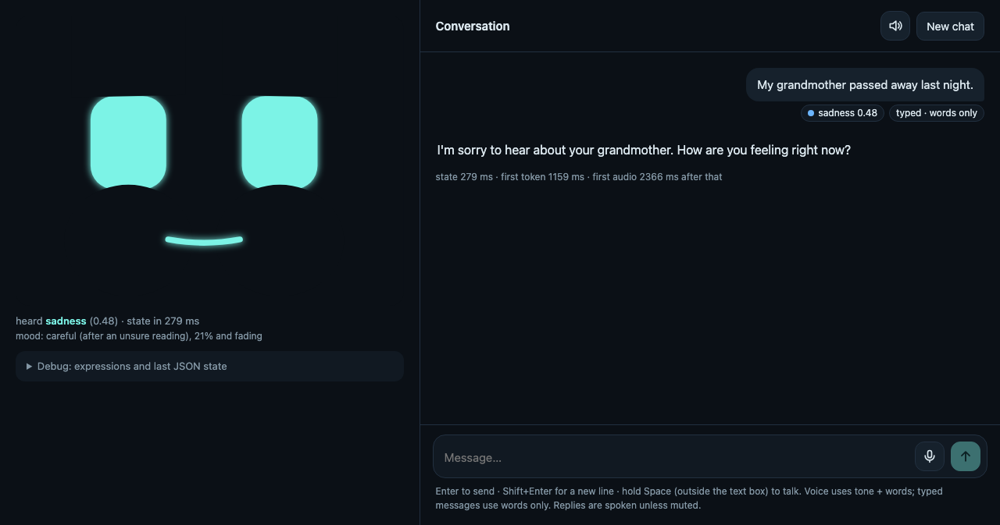

# Emotion-aware character: text + audio emotion recognition on MELD

A local, real-time character you can talk to. It hears **what you say and how you say it**,
recognizes one of seven emotions, shows that on an animated face, and answers in its own
voice with a short reply whose tone fits how you feel. Everything runs offline on one
laptop (Apple M5, 24 GB), within a 6B-parameter budget.



| | |
| --- | --- |
| Emotion model, MELD test | **0.614 ± 0.006** weighted F1, words + voice + dialogue context (3 seeds) |
| What the voice adds | text without context 0.609 → **0.621** with voice |
| Face reacts after you stop talking | median **46 ms** (152 ms when Whisper transcribes you) |
| Character starts speaking | median **752 ms** after you stop |
| Size | 2,086,294,769 parameters, 35% of the 6B limit; peak memory 5.49 GB |
| Verified | `evaluation/10_system_check.py`: every requirement and live-system check passes |

## Where this could be used

The goal is a character that responds to people the way a person would: noticing *how*
something was said, not just what. Because it is small and fully local, the same pipeline
fits places where sending someone's voice to a server is not acceptable:

- **Social and companion robots**: a face and tone that follow the person's mood across a conversation.
- **Care and check-in companions** for older adults or patients: noticing sadness or worry and answering gently.
- **Tutoring and learning apps**: spotting frustration and slowing down before a learner gives up.
- **Kiosks, games and virtual characters**: assistants and NPCs whose reactions match the user's tone.
- **Accessibility**: making emotional cues explicit for people who find them hard to read.

## Talk to the character

```bash
# once: Python 3.11 + ffmpeg (brew install ffmpeg)
uv venv --python 3.11 .venv && source .venv/bin/activate   # or python3.11 -m venv .venv
uv pip install -r requirements.txt                         # or pip install -r requirements.txt
python training/01_check_environment.py                    # downloads the model weights (~10 GB)

# every time
python app/server.py                                       # then open http://localhost:8000
```

The trained heads ship in `models/`, so no dataset or training is needed to chat. The page
talks only to that local server (bound to 127.0.0.1).

| To | Do |
| --- | --- |
| **Type** | Write and press **Enter**. Read from your words. |
| **Talk** | Click the **mic**, speak, click again (or hold **Space**). Read from your tone *and* words. |
| **Mute** | The **speaker** button; replies then appear word by word. |
| **Start over** | **New chat** clears the context and the face's mood. |
| **Look inside** | **Debug** under the face: every expression, and the JSON state of the last turn. |

On each turn the face **listens** (eyes widen and pulse with your voice), **thinks** (a
glance up), **reacts** to the emotion it heard (more strongly the more confident it is),
then **replies** with an empathic face rather than a mirror: calm when you are angry,
gentle when you are sad, with its mouth following its own voice. Between turns it does not
snap back to neutral: it **keeps a mood** shaped by the conversation, which fades with a
one-minute half-life, so a sad exchange stays subdued and a happy one stays bright. Each of
your messages is tagged with what it heard (`anger 0.73 · voice · tone changed it from joy`).
If it hears nothing usable, it says so instead of guessing.

`python demo.py --meld test dia113_utt10` runs one utterance from the command line and
prints the JSON state before the streamed reply (`evals/system/demo_trace.txt`). There, the
words "It's throwing and catching!" read as joy, but the voice is angry: the fused model
answers anger (0.73), which is the gold label.

## How it works

```
 your voice (16 kHz) ───────────────┐                       typed message
        │ Whisper-small (if no text)│                             │
        ▼                           ▼                             │
 RoBERTa-base (frozen)        WavLM-base-plus (frozen)            │
 previous 2 lines + you       13 layers, learned weighting        │
        └──────────── fusion head (MLP) ────────────┘      text-only head
                              │                                   │
              calibrated emotion + confidence ──► JSON state ◄─────┘
                              │                       │
                              │                 face reacts at once
                              ▼
     tone guidance ("stay calm and steady…") ──► Qwen2.5-1.5B-Instruct ──► Kokoro-82M ──► voice
```

| Component | Model | Parameters |
| --- | --- | ---: |
| Text encoder | `roberta-base` | 124,055,040 |
| Audio encoder | `microsoft/wavlm-base-plus` | 94,381,936 |
| Fused emotion head (voice) | own MLP, `models/fused.pt` | 398,356 |
| Text-only emotion head (typed) | own MLP, `models/text_ctx.pt` | 200,199 |
| Speech recognition | `openai/whisper-small` | 241,734,912 |
| Reply model | `Qwen/Qwen2.5-1.5B-Instruct` | 1,543,714,304 |
| Speech | `hexgrad/Kokoro-82M` | 81,810,022 |
| **Total** | | **2,086,294,769** |

Design choices that matter:

- **Frozen encoders, cached features**: every model and seed trains in about a minute, which
  made a real 7-model ablation possible. No encoder was ever trained on emotion labels, so
  nothing leaks from MELD's test set.
- **Calibrated confidence** (temperature scaling, fit on dev): the face's intensity and the
  reply's caution both use it, so it has to mean what it says.
- **The reply model never sees an emotion word.** Each emotion becomes tone guidance, three
  short examples set the style, and two rules are enforced in decoding: stop after two
  sentences, never name the emotion. Result: 100% of replies within two sentences and none
  naming an emotion, with the first token at a median 308 ms (`evals/replies/reply_compliance.md`;
  the inputs there are sitcom lines, so this checks the rules and speed, not reply quality).
- **Turn-level real time**: the emotion state is ready before the reply, so the face changes first.

## Results

Seven models on the same 2,610 MELD test utterances, mean ± std over 3 seeds, every choice
made on dev. Full report with per-emotion scores and a confusion matrix for every model:
**[evals/classifiers/comparison.md](evals/classifiers/comparison.md)**.


| Model | Accuracy | Macro F1 | Weighted F1 |
| --- | ---: | ---: | ---: |
| Logistic regression (words) | 0.573 ± 0.000 | 0.390 ± 0.000 | 0.564 ± 0.000 |
| Words | 0.616 ± 0.001 | 0.436 ± 0.007 | 0.609 ± 0.002 |
| Words + context | 0.619 ± 0.005 | 0.433 ± 0.005 | 0.613 ± 0.005 |
| Voice | 0.482 ± 0.007 | 0.291 ± 0.002 | 0.469 ± 0.002 |
| Late fusion | 0.635 ± 0.003 | 0.436 ± 0.008 | 0.618 ± 0.005 |
| Words + voice | 0.619 ± 0.003 | 0.450 ± 0.004 | 0.621 ± 0.003 |
| **Words + context + voice (deployed)** | **0.619 ± 0.007** | **0.441 ± 0.008** | **0.614 ± 0.006** |

**Accuracy per emotion** (deployed model, mean over seeds):

| Emotion | Test utterances | Recall (accuracy on it) | Precision | F1 |
| --- | ---: | ---: | ---: | ---: |
| neutral | 1,256 | 0.787 | 0.757 | 0.772 |
| joy | 402 | 0.575 | 0.549 | 0.559 |
| surprise | 281 | 0.543 | 0.512 | 0.525 |
| anger | 345 | 0.446 | 0.502 | 0.472 |
| sadness | 208 | 0.324 | 0.416 | 0.364 |
| fear | 50 | 0.220 | 0.208 | 0.213 |
| disgust | 68 | 0.172 | 0.197 | 0.181 |

- The voice helps most where words are ambiguous: without dialogue context it lifts weighted
  F1 from 0.609 to 0.621 and macro F1 from 0.436 to 0.450.
- With context, the voice adds little on test (0.613 → 0.614), though 0.015 on dev, where the
  deployed model was chosen; context and tone resolve many of the same lines.
- Confidence is trustworthy: test calibration error 0.028 after temperature scaling (0.057
  before), and predictions with 0.9-1.0 confidence are right 94% of the time.

**Latency** (50 test clips, after warm-up, `evals/system/latency.json`):

| Stage | p50 (ms) | p95 (ms) |
| --- | ---: | ---: |
| Emotion state, transcript supplied | 45.8 | 77.0 |
| Emotion state, including Whisper | 151.8 | 235.8 |
| First reply token, after the state | 205.4 | 267.2 |
| End of speech → character's voice ready | 752.4 | 1108.7 |

The Apple GPU slows down when idle (312 ms for the state after 20 s of quiet), so the page
keeps it warm while you type or talk (`evals/system/idle_latency.md`).

## Where the model struggles

Full analysis: **[evals/struggles/analytics.md](evals/struggles/analytics.md)**.


- **Rare emotions collapse into neutral**: disgust and fear have only 68 and 50 test lines;
  a real emotion called neutral is 33% of all errors.
- **High-energy emotions trade places**: joy → anger and anger → surprise are among the most common mistakes.
- **Live speech costs the most**: on Whisper's transcripts (35.3% word error rate on this
  sitcom audio) accuracy falls to 55.2%.
- **Part of the ceiling is the labels**: 29% of train utterances are misclassified in every
  cross-validation fold of every seed, many of them debatable ("No!" labeled disgust).
  Training harder on those failures made the model worse
  ([evals/experiments/train_on_failures.md](evals/experiments/train_on_failures.md)); RL or
  DAgger do not fit single-utterance classification, but do fit reacting while you speak (below).

## Prior work: EMODE, and what this project improves

[EMODE](https://github.com/ShrishChou/EMODE) is my earlier speech emotion project: a CNN
trained from scratch on log-mel spectrograms of 2-second windows, pooling four acted-speech
corpora (CREMA-D, ESD, RAVDESS, TESS) into five emotions, as the teacher for a planned
distillation step. This project reuses its audio normalization (`emode_normalize` in
[src/audio.py](src/audio.py)) and goes further:

| | EMODE | This project |
| --- | --- | --- |
| Speech | Isolated, acted studio sentences | Multi-party dialogue in context (MELD, *Friends*) |
| Emotions | 5 | 7 (adds fear and disgust) |
| Signals | Voice only | Voice **and** words **and** the previous lines |
| Audio model | CNN from scratch, 2 s windows | Self-supervised WavLM, all 13 layers, whole utterance |
| Evaluation | No published numbers | Official splits, 7-model ablation, 3 seeds, calibration, error analysis |
| Output | A classifier | A real-time character: emotion state, reply, voice, face |

EMODE's multi-corpus training targets robustness to recording conditions, which a single
sitcom cannot give; it is the natural next voice branch.

## Why the model is weak, and how to make it better

MELD is a sitcom. Actors perform scripted lines to each other over a laugh track, and
annotators labeled each line while watching the scene. That shapes what any model trained
on it can learn:

- **Performed, not felt.** Delivery is pitched for an audience; real people are subtler.
- **Labels come from the whole scene.** Annotators saw faces, plot and the joke; this model
  hears one line and the two before it, so some labels cannot be recovered from its inputs.
  That is part of why fear and disgust stay low.
- **One label per line.** A majority vote hides real disagreement between annotators, which
  is why 29% of train is misclassified by every model in cross-validation.
- **Few examples where it matters.** Fear and disgust have only a few hundred training lines each.
- **Not the robot's audio.** Laugh tracks, music and studio microphones, not a room.

With more time I would change the data and the targets before the model:

1. **Train on natural conversational speech, from more than one corpus.** Add MSP-Podcast
   (natural podcast speech with emotion labels) and IEMOCAP (two-person conversations, partly
   improvised) to MELD, and hold one corpus out entirely to measure how well the model
   transfers. EMODE's multi-corpus pooling was the first step in this direction.
2. **Predict valence and arousal, not only seven categories.** Continuous "how positive" and
   "how energetic" scores (MSP-Podcast and IEMOCAP both have them) avoid forcing a hard
   choice between neighbors like anger and disgust, and drive the face directly (smile with
   valence, eye openness with arousal).
3. **Learn from disagreement instead of a single vote.** Train on soft labels (the share of
   annotators choosing each emotion, from corpora that release individual votes) or with
   label smoothing, so ambiguous lines stop being
   counted as hard errors, and report agreement with annotators rather than exact match.
4. **Close the gap to a real microphone.** Augment training audio with room reverberation,
   background noise and distance, and continue WavLM's self-supervised pretraining on
   unlabeled audio from the target microphone (no labels needed).
5. **Fine-tune the encoders lightly** with small adapters (e.g. LoRA) instead of keeping them
   frozen, and use a stronger speech recognizer: Whisper-small costs about 0.10 weighted F1,
   the largest single loss measured here.
6. **Evaluate with real people.** The honest test is people talking to the character and
   saying whether it understood them. Consented, labeled clips from those sessions would also
   be the best data for fine-tuning and recalibrating the model.

For the character itself: run the emotion model on partial audio every half second so the
face reacts *while* you speak (when to commit to a reaction is where DAgger fits, with the
full-utterance model as the expert); predict how your sentence will end so it can react to
the content as it unfolds and draft its reply early; and add voice activity detection for
hands-free turns.

## Reproduce everything

Every number above comes from a file in `evals/` (the system check verifies that).

```bash
# MELD audio with the official splits (1.5 GB)
python -c "from huggingface_hub import snapshot_download; snapshot_download('ajyy/MELD_audio', repo_type='dataset', local_dir='data/raw/meld_audio_hf')"
cd data/raw/meld_audio_hf && for s in train dev test; do tar -xzf archive/$s.tar.gz; done && cd -

python training/02_prepare_meld.py            # ~1 min   clips -> 16 kHz wav, manifests
python training/03_extract_features.py        # ~10 min  RoBERTa + WavLM embeddings
python training/04_train_classifiers.py       # ~1 min   5 heads x 3 seeds -> models/
python evaluation/01_compare_classifiers.py   # evals/classifiers/
python evaluation/02_asr_transcripts.py       # evals/asr/ (Whisper)
python evaluation/03_analyze_errors.py        # evals/struggles/
python evaluation/04_count_parameters.py      # evals/system/params.json
python evaluation/05_benchmark_latency.py     # evals/system/latency.json
python evaluation/10_system_check.py          # evals/system/system_check.md
```

Scripts 06-09 in `evaluation/` are the studies (idle latency, reply models, Whisper-matched
training, training on failures); [evals/README.md](evals/README.md)
indexes every output. Training is deterministic: rerunning it reproduces `models/` bit for bit.

```
app/          the character: server.py + web/ (chat page, SVG face)
src/          the library: audio, encoders, fusion head, training, pipeline, replies, speech
models/       trained emotion heads; meta.json names the two the app uses
training/     steps 01-04             evaluation/   scripts 01-10
evals/        every result, by topic  docs/images/  screenshots
demo.py       command-line demo       config.py     every setting in one place
NOTES.md      every assumption, deviation and fallback, in order
```

## Limitations

- Trained on one sitcom (laugh track, studio sound, exaggerated delivery); a robot's
  microphone hears ordinary speech in ordinary rooms.
- MELD labels are noisy and imbalanced, and fear and disgust have few examples.
- Live speech goes through Whisper-small, which costs about 0.10 weighted F1.
- Replies are checked for rules and speed on sitcom lines; whether they are *good* replies can
  only be judged by real people talking to the character, which this prototype has not had.
- Measured on one machine (Apple M5); CUDA and CPU paths exist but were not run.
- Left out by design: vision, fine-tuning the encoders or the LLM, and reacting before the
  person finishes speaking.

## Credits and licenses

| Component | License |
| --- | --- |
| [MELD](https://github.com/declare-lab/MELD) (Poria et al., 2019), via the [ajyy/MELD_audio](https://huggingface.co/datasets/ajyy/MELD_audio) mirror | GPL-3.0 |
| [EMODE](https://github.com/ShrishChou/EMODE) (my prior work): audio normalization | own |
| RoBERTa-base | MIT |
| WavLM-base-plus (released in [microsoft/unilm](https://github.com/microsoft/unilm)) | MIT |
| Whisper-small, Qwen2.5-1.5B-Instruct, Kokoro-82M | Apache-2.0 |
| misaki, spaCy `en_core_web_sm` (Kokoro's text front end) | Apache-2.0, MIT |
| espeak-ng (bundled by espeakng-loader; Kokoro's fallback for unknown words) | GPL-3.0 |

Written for this project: everything in `app/`, `src/`, `training/`, `evaluation/`,
`demo.py` and `config.py`, and the trained heads. The face's design (a few procedural
parameters, a one-line mouth) is inspired by Cozmo/Vector-style eyes and the M5Stack-Avatar
face of Stack-chan; no code or assets were copied. Two result files include MELD test
transcripts, which GPL-3.0 permits.
