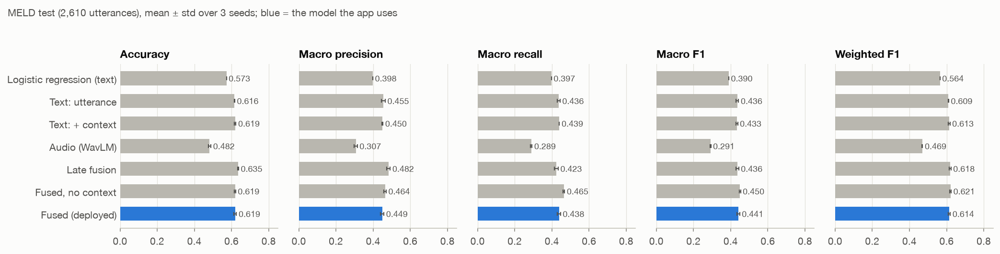
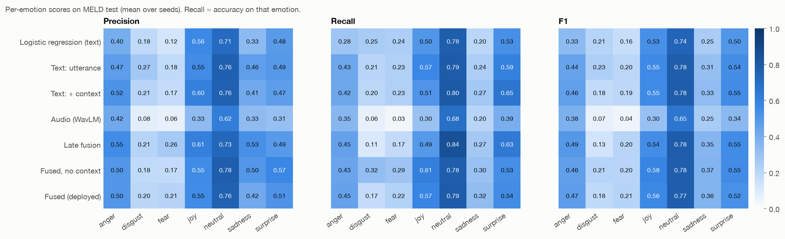
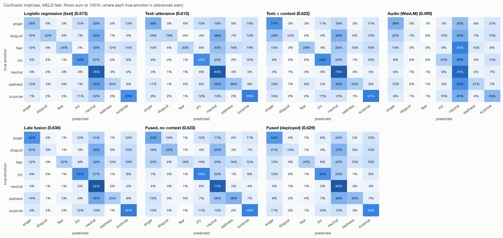
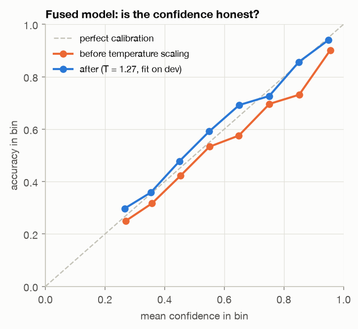

# Emotion classifiers compared (MELD test)

All models see the same 2,610 test utterances (official MELD split). Numbers are mean ± std over 3 training seeds (logistic regression: one run). Every choice was made on dev. Produced by `evaluation/01_compare_classifiers.py` from `predictions.npz`.

| Model | Input | Accuracy | Macro precision | Macro recall | Macro F1 | Weighted F1 | Dev weighted F1 |
| --- | --- | ---: | ---: | ---: | ---: | ---: | ---: |
| Logistic regression (text) | utterance embedding, sklearn LogisticRegression | 0.573 ± 0.000 | 0.398 ± 0.000 | 0.397 ± 0.000 | 0.390 ± 0.000 | 0.564 ± 0.000 | 0.545 ± 0.000 |
| Text: utterance | utterance | 0.616 ± 0.001 | 0.455 ± 0.010 | 0.436 ± 0.008 | 0.436 ± 0.007 | 0.609 ± 0.002 | 0.593 ± 0.003 |
| Text: + context | context + utterance | 0.619 ± 0.005 | 0.450 ± 0.004 | 0.439 ± 0.001 | 0.433 ± 0.005 | 0.613 ± 0.005 | 0.597 ± 0.004 |
| Audio (WavLM) | audio | 0.482 ± 0.007 | 0.307 ± 0.008 | 0.289 ± 0.004 | 0.291 ± 0.002 | 0.469 ± 0.002 | 0.475 ± 0.006 |
| Late fusion | mean of text_ctx and audio probabilities | 0.635 ± 0.003 | 0.482 ± 0.010 | 0.423 ± 0.010 | 0.436 ± 0.008 | 0.618 ± 0.005 | 0.595 ± 0.003 |
| Fused, no context | utterance + audio | 0.619 ± 0.003 | 0.464 ± 0.006 | 0.465 ± 0.004 | 0.450 ± 0.004 | 0.621 ± 0.003 | 0.600 ± 0.002 |
| **Fused (deployed)** | context + utterance + audio | 0.619 ± 0.007 | 0.449 ± 0.009 | 0.438 ± 0.008 | 0.441 ± 0.008 | 0.614 ± 0.006 | 0.612 ± 0.002 |

Weighted scores follow the MELD convention (neutral is about half of test); macro scores weigh the seven emotions equally, which is why they are much lower.

## Per emotion

**Precision**, mean over seeds

| Model | anger | disgust | fear | joy | neutral | sadness | surprise |
| --- | ---: | ---: | ---: | ---: | ---: | ---: | ---: |
| Logistic regression (text) | 0.400 | 0.185 | 0.124 | 0.560 | 0.707 | 0.333 | 0.479 |
| Text: utterance | 0.470 | 0.267 | 0.180 | 0.545 | 0.765 | 0.465 | 0.491 |
| Text: + context | 0.519 | 0.206 | 0.172 | 0.604 | 0.762 | 0.414 | 0.471 |
| Audio (WavLM) | 0.419 | 0.077 | 0.062 | 0.331 | 0.620 | 0.330 | 0.307 |
| Late fusion | 0.549 | 0.214 | 0.261 | 0.605 | 0.729 | 0.531 | 0.486 |
| Fused, no context | 0.501 | 0.181 | 0.174 | 0.553 | 0.777 | 0.497 | 0.568 |
| Fused (deployed) | 0.502 | 0.197 | 0.208 | 0.549 | 0.757 | 0.416 | 0.512 |

**Recall (accuracy on that emotion)**, mean over seeds

| Model | anger | disgust | fear | joy | neutral | sadness | surprise |
| --- | ---: | ---: | ---: | ---: | ---: | ---: | ---: |
| Logistic regression (text) | 0.284 | 0.250 | 0.240 | 0.502 | 0.777 | 0.197 | 0.530 |
| Text: utterance | 0.428 | 0.206 | 0.227 | 0.570 | 0.787 | 0.242 | 0.594 |
| Text: + context | 0.424 | 0.196 | 0.227 | 0.510 | 0.796 | 0.272 | 0.649 |
| Audio (WavLM) | 0.351 | 0.059 | 0.033 | 0.299 | 0.684 | 0.204 | 0.393 |
| Late fusion | 0.450 | 0.108 | 0.173 | 0.492 | 0.840 | 0.266 | 0.635 |
| Fused, no context | 0.435 | 0.319 | 0.287 | 0.608 | 0.775 | 0.298 | 0.531 |
| Fused (deployed) | 0.446 | 0.172 | 0.220 | 0.575 | 0.787 | 0.324 | 0.543 |

**F1**, mean over seeds

| Model | anger | disgust | fear | joy | neutral | sadness | surprise |
| --- | ---: | ---: | ---: | ---: | ---: | ---: | ---: |
| Logistic regression (text) | 0.332 | 0.212 | 0.163 | 0.529 | 0.740 | 0.248 | 0.503 |
| Text: utterance | 0.443 | 0.232 | 0.199 | 0.555 | 0.776 | 0.308 | 0.537 |
| Text: + context | 0.460 | 0.178 | 0.192 | 0.551 | 0.779 | 0.326 | 0.545 |
| Audio (WavLM) | 0.381 | 0.066 | 0.043 | 0.304 | 0.649 | 0.250 | 0.343 |
| Late fusion | 0.493 | 0.130 | 0.203 | 0.540 | 0.780 | 0.353 | 0.550 |
| Fused, no context | 0.463 | 0.215 | 0.204 | 0.578 | 0.776 | 0.366 | 0.546 |
| Fused (deployed) | 0.472 | 0.181 | 0.213 | 0.559 | 0.772 | 0.364 | 0.525 |

Test utterances per emotion: anger 345, disgust 68, fear 50, joy 402, neutral 1,256, sadness 208, surprise 281.

## Confusion matrices

Each model's saved (best-on-dev) seed. Rows are the true emotion and sum to 100%.

One file per model: [Logistic regression (text)](confusion_matrices/logreg.png), [Text: utterance](confusion_matrices/text.png), [Text: + context](confusion_matrices/text_ctx.png), [Audio (WavLM)](confusion_matrices/audio.png), [Late fusion](confusion_matrices/late_fusion.png), [Fused, no context](confusion_matrices/fused_utt.png), [Fused (deployed)](confusion_matrices/fused.png).

## Calibration

| Model | Temperature (fit on dev) | Dev ECE before → after | Test ECE before → after |
| --- | ---: | ---: | ---: |
| fused | 1.273 | 0.055 → 0.031 | 0.057 → 0.028 |
| text_only | 1.013 | 0.030 → 0.034 | 0.024 → 0.025 |
