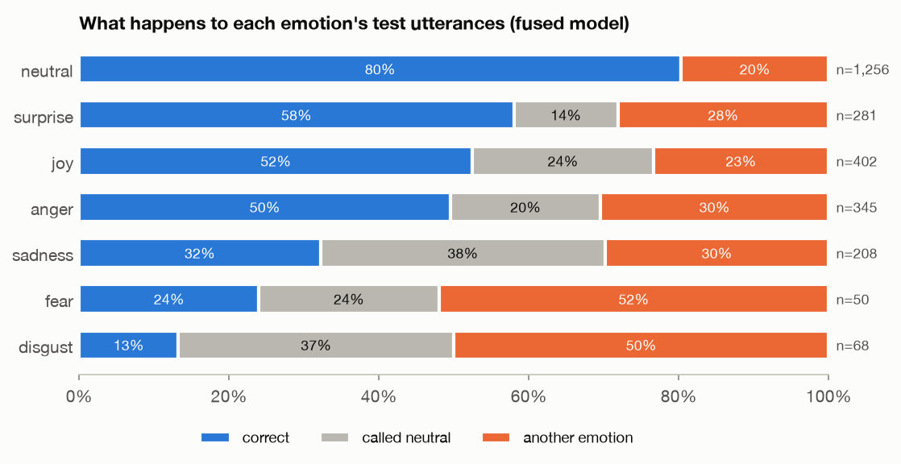
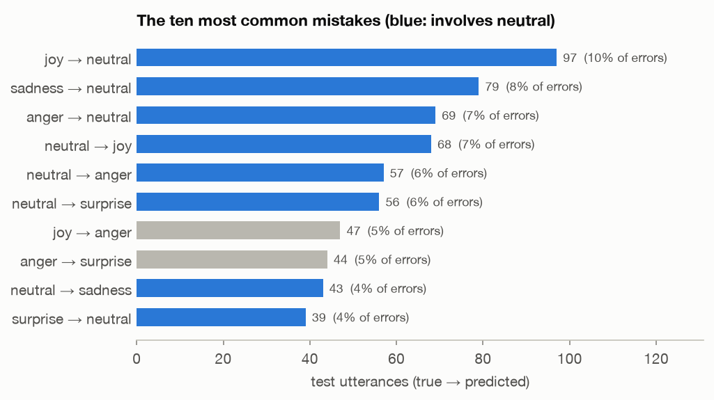
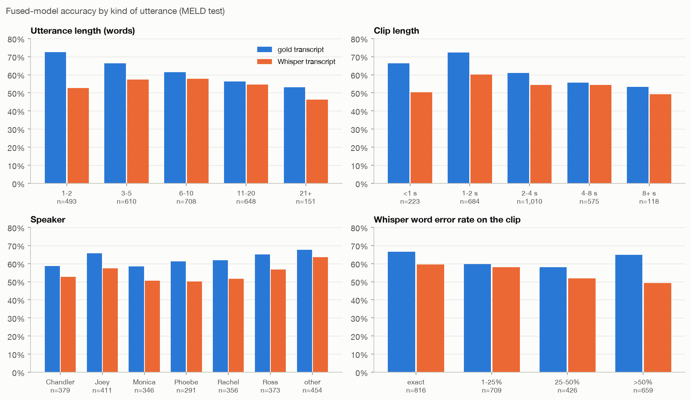
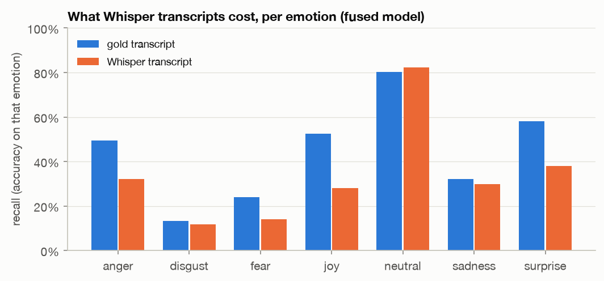
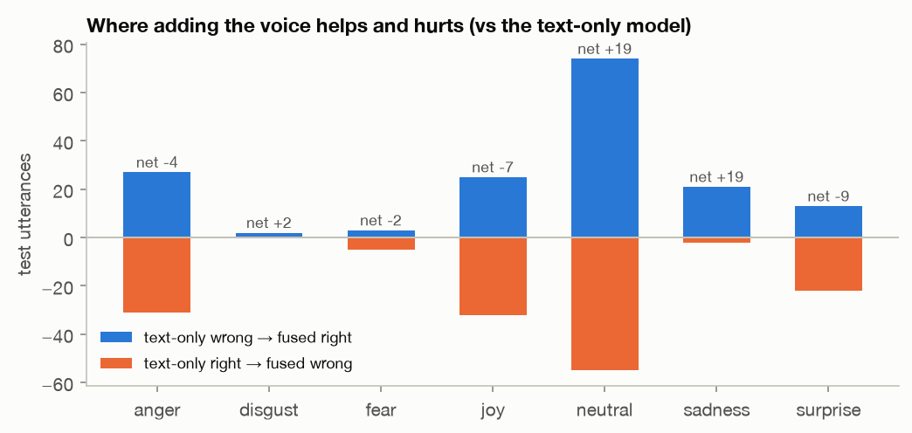
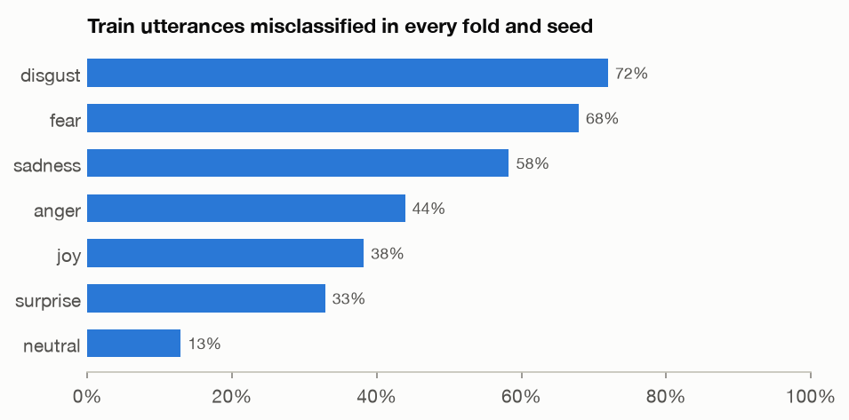

# Where the emotion model struggles

The deployed fused model gets **62.9%** of the 2,610 MELD test utterances right (weighted F1 0.622, macro F1 0.449). Its errors are not spread evenly: they concentrate in the rare emotions, in long utterances, and in live use with Whisper transcripts. Produced by `evaluation/03_analyze_errors.py`; every utterance is in `test_predictions.csv`.

## 1. Rare emotions collapse into neutral

Neutral is 48% of test and the model's safe default. The three weakest emotions are **disgust, fear, sadness**, right only 13%, 24%, 32% of the time. 321 of the 968 errors (33%) are a real emotion called neutral, and another 247 (26%) are neutral lines given an emotion.

| True emotion | n | correct | called neutral | another emotion |
| --- | ---: | ---: | ---: | ---: |
| disgust | 68 | 0.132 | 0.368 | 0.500 |
| fear | 50 | 0.240 | 0.240 | 0.520 |
| sadness | 208 | 0.322 | 0.380 | 0.298 |
| anger | 345 | 0.496 | 0.200 | 0.304 |
| joy | 402 | 0.525 | 0.241 | 0.234 |
| surprise | 281 | 0.580 | 0.139 | 0.281 |
| neutral | 1,256 | 0.803 | 0.000 | 0.197 |

## 2. The most common mistakes

| True → predicted | Count | Share of all errors |
| --- | ---: | ---: |
| joy → neutral | 97 | 10% |
| sadness → neutral | 79 | 8% |
| anger → neutral | 69 | 7% |
| neutral → joy | 68 | 7% |
| neutral → anger | 57 | 6% |
| neutral → surprise | 56 | 6% |
| joy → anger | 47 | 5% |
| anger → surprise | 44 | 5% |
| neutral → sadness | 43 | 4% |
| surprise → neutral | 39 | 4% |

Beyond neutral, the high-arousal emotions (anger, joy, surprise) trade places with each other: 91 of the errors in the top ten are one of them mistaken for another.

## 3. Which utterances are hard

- **Longer lines are harder**: 72% accuracy on 1-2 word utterances, 53% on 21+ words, plausibly because a long line can mix several emotions under one label.
- **Speakers differ little** (from 58% to 68%); no one character's style dominates the errors.
- **Dialogue context**: first lines of a dialogue 68%, lines with context 62%.

| Utterance length (words) | n | share | accuracy, gold text | accuracy, Whisper text | text-only accuracy |
| --- | ---: | ---: | ---: | ---: | ---: |
| 1-2 | 493 | 19% | 0.724 | 0.527 | 0.708 |
| 3-5 | 610 | 23% | 0.664 | 0.574 | 0.675 |
| 6-10 | 708 | 27% | 0.614 | 0.578 | 0.607 |
| 11-20 | 648 | 25% | 0.563 | 0.545 | 0.556 |
| 21+ | 151 | 6% | 0.530 | 0.464 | 0.483 |

## 4. Live speech: Whisper transcripts

With Whisper's transcripts instead of the gold ones, accuracy falls from 62.9% to 55.2%. Even clips Whisper transcribes word-perfectly lose accuracy (67% → 59%): there the only differences are punctuation, casing and the context lines, which are Whisper's too; clips with over 50% word errors fall to 49%. The largest recall drops are joy (−24 points), surprise (−20 points), anger (−17 points). Retraining on Whisper transcripts recovers only a little (`evals/asr/asr_matched.md`).

| Recall | gold transcript | Whisper transcript |
| --- | ---: | ---: |
| anger | 0.496 | 0.322 |
| disgust | 0.132 | 0.118 |
| fear | 0.240 | 0.140 |
| joy | 0.525 | 0.281 |
| neutral | 0.803 | 0.823 |
| sadness | 0.322 | 0.298 |
| surprise | 0.580 | 0.381 |

## 5. Where the voice helps and hurts

Adding the voice fixes 165 text-only errors and breaks 147 right answers. It helps most on neutral (net +19) and sadness (net +19), and hurts most on surprise (net −9) and joy (net −7). Examples, picked mechanically: [examples.md](examples.md).

## 6. Some errors are label noise, not model failures

In 5-fold cross-validation on train, 29% of train utterances are misclassified in every fold and every seed, including 72% of disgust and 68% of fear. A random sample (`hard_train_examples.md`) is full of lines whose label is hard to defend from the words, such as "No!" labeled disgust. Training harder on these makes the model worse (`evals/experiments/train_on_failures.md`), so part of the remaining error is a ceiling set by the labels.

## 7. When to trust a prediction

Confidence is honest (temperature-scaled; see `evals/classifiers/charts/calibration_fused.png`): predictions with 0.9-1.0 confidence are right 94% of the time, those under 0.4 only 34%. The character uses this: its face blends toward the resting expression by 1 − confidence, and below 0.5 the reply is told not to assume how the person feels.

| Confidence (fused, gold transcript) | n | share | accuracy |
| --- | ---: | ---: | ---: |
| <0.4 | 476 | 18% | 0.342 |
| 0.4-0.5 | 436 | 17% | 0.477 |
| 0.5-0.6 | 394 | 15% | 0.591 |
| 0.6-0.7 | 357 | 14% | 0.692 |
| 0.7-0.8 | 336 | 13% | 0.726 |
| 0.8-0.9 | 327 | 13% | 0.856 |
| 0.9-1.0 | 284 | 11% | 0.940 |

## What would help most

1. **A stronger ASR model** for live use: Whisper costs more accuracy than any modeling choice here.
2. **Fine-tuning the text encoder** on MELD train, the usual route to higher MELD scores (not measured here).
3. **Better labels, or soft labels, for the rare emotions**: much of the disgust and fear error looks like annotation ambiguity rather than a learnable signal.
4. Not more weight on hard examples, not RL: both were considered and the first was measured to hurt.
